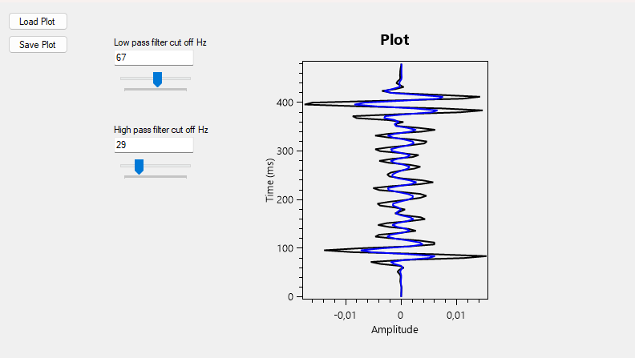

# seismicplot
Plotting seismic waves and apply low pass or high pass filters

This is a simple program that plots seismic data on the screen and applies high pass and low pass filters to it.

The following screenshot shows all the parts of the program.




## Using the program

### Load Plot

Before loading a plot, all controls will be disabled. A plot is a Json file that contains at least two fields:
- interval: the avarage interval between signals, in milliseconds, a positive floating point number.
- data: each signal amplitude of the seismic wave, a list of floating point numbers.

By loading a file, the program will draw the plot of the data and enable the controls.


### Plot

As you load a data file, the program will draw the graphic on the Plot area. It
maps the wave amplitude on the X axis and the time in milliseconds on the Y
axis. It draws two lines that start identical: the black line is the
original plot of the data without modification, and the blue line is the plot
of the data modified by the filters.


### Save Plot

This button saves the plot of both the original data and the data modified by the filters.
This will be saved on a Json file with additional fields as previously described:
- highPassFrequencyCut: the cutting point of the high pass filter, a floating point number
- lowPassFrequencyCut: the cutting poin of the low pass filter, a floating point number
- modifiedData: the resulting data with the filterss applied upon the original data, a list of floating point numbers

Note: I understand that it is not necessary to save the modified data, since it can be obtained with the
cuttinng points alone. This and the related function `UpdateModifiedPlot` are therefore subject to revision in the future.


### Low pass filter cut off Hz and Highh pass filter cut off Hz

These fields control the cutting point of the low pass filter and the high pass filter respectively.
You can edit the text fields or move the tracking bar below them to modify their values. Values are bounded to 
0 as minimum and to the Nyquist rate as maximum. An empty field indicates that the filter is not applied.
The plot will update the blue line according to the filtered result. As you interact with the box or
the bar, the plot will update the blue lined modified data dynamically leaving the original black line as it is.


## Programming

This is a Windows Forms program designed modularly. The plot and its controls are a `UserControl`
component called `SeismicPlot`, and It can be added to any Form. 

The save and load buttons are a bespoke solution to input and output data to and from this component.
Data is mapped to the `SeismicData` plain old object.


### `DrawPlot`

To load data to the `SeismicPlot`, use the `DrawPlot` function passing the data list and the sample interval.

```
public void DrawPlot(float[] data, float sampleInterval, string plotName="Plot")
```
- data: an array with all the seismic wave amplitude data
- sampleInterval: the mean interval of the signals, in milliseconds
- plotName: the name to exhibit over the plot


### `UpdateModifiedPlot`

To apply the cut frequencies and update the blue lined filtered data, call the function `UpdateModifiedPlot` passing
the modified data, the high frequency cut and the low frequency cut. Do not call this function before `DrawPlot`.

```
public void UpdateModifiedPlot(float[] modifiedData, float highPassFrequency, float lowPassFrequency) 
```
- modifiedData: an array of all the seismic wave amplitude data
- highPassFrequency: the cutting point of the high pass filter, in Hz
- lowPassFrequency: the cutting point of the low pass filter, in Hz

